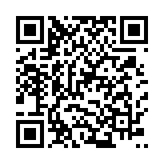

<!-- Copyright (C) 2026 rezky_nightky -->
<!-- SPDX-License-Identifier: GPL-3.0-only -->

# Zelynic Commercial License

zelynic is dual-licensed:

- **GPL-3.0-only** for open-source use (see [LICENSE](LICENSE)).
- **Commercial License** for proprietary and commercial use (this document).

If your use of zelynic can satisfy the copyleft obligations of the
GPL-3.0-only — including releasing your modifications, integrations, and
the corresponding source code to anyone you distribute to — you do not
need to pay anything. The GPL path is complete, free, and first-class;
it is not a trial. The Commercial License exists for the uses GPL
cannot honestly cover: keeping your modifications proprietary,
embedding zelynic in a closed product, or redistributing it under
different terms.

---

## 1. Who Needs a Commercial License

You need a Commercial License if any of the following describe your use:

- **Production use at a company** — running zelynic to shape, limit, or
  monitor traffic on commercial infrastructure, where the GPL's
  copyleft obligations (open-sourcing your modifications and
  integrations) cannot or will not be met.
- **SaaS offerings** — providing a hosted service whose value depends on
  zelynic, where you would otherwise be obligated to release your
  service's zelynic-related source code.
- **Internal business tools** — shipping zelynic inside a closed
  internal tool, appliance, or image beyond what the GPL permits
  without disclosure.
- **Redistribution under different terms** — distributing zelynic (or a
  derivative) under terms other than GPL-3.0-only.
- **Any use that cannot meet GPL-3.0 copyleft obligations** — when in
  doubt about whether your use complies, that doubt is the signal to
  either study [LICENSE](LICENSE) carefully or buy the license that
  removes the question.

## 2. Who Does NOT Need One

The following uses are fully covered by GPL-3.0-only and cost nothing:

- **Personal use** — limiting and monitoring bandwidth on your own
  machines.
- **Hobby projects** — experiments, home labs, self-hosted setups.
- **Non-commercial research** — academic study, benchmarking,
  measurement, and publication of results.
- **Education** — teaching, coursework, and learning.
- **Open-source contributions back to upstream** — forking, fixing,
  extending, and opening PRs against this repository. The
  [trademark policy](TRADEMARK.md) governs the Marks, not this
  license; contribution forks keep the name unchanged and are welcome
  without permission or payment.

## 3. Pricing

Prices are pegged to USD, payable in cryptocurrency (see
[Payment](#5-payment) below). Tiers are self-declared by the buyer in
good faith — pick the tier that honestly matches your situation; nobody
audits you, but misrepresenting revenue to underpay is a breach of the
license terms.

| Tier       | Price          | Target                                                       |
| ---------- | -------------- | ------------------------------------------------------------ |
| Personal   | Free (GPL-3.0) | Hobby, personal, non-commercial, open-source contributions   |
| Individual | $99/year       | Solo devs, freelancers, revenue < $100K/year                 |
| Business   | $1,000/year    | SMB, revenue $100K – $10M/year                               |
| Company    | $9,900/year    | Enterprise (>$10M/year revenue) OR any redistribution rights |

Notes:

- **Revenue thresholds** refer to your total annual revenue (company or
  individual, whichever applies), not your zelynic-specific revenue.
- **Multi-year discount** (owner discretion): 20% off a 2-year term,
  30% off a 3-year term.
- **Redistribution rights** are granted at the Company tier only.
  Trademark licensing is separate — see
  [TRADEMARK.md](TRADEMARK.md).
- No free tier above Personal is granted without explicit owner
  approval.

## 4. What Each Tier Grants

Every paid tier grants, for the license term:

- **Use without GPL copyleft** — the right to use, modify, and integrate
  zelynic in your products and infrastructure without the obligation to
  open-source your modifications.
- **Priority support** — your licensing and integration questions are
  answered ahead of the free queue.
- **Internal modification rights** — private forks and patches for your
  own use, with no disclosure requirement.

The **Company** tier additionally grants:

- **Redistribution rights** — the right to distribute zelynic (or your
  derivative of it) as part of your own offering, under your own terms,
  to your customers. This is the only tier that carries it.
- Rebranding and redistribution of the Marks still requires separate
  trademark permission — see [TRADEMARK.md](TRADEMARK.md).

## 5. Payment

Payment is **USD-pegged, paid in crypto**: send the cryptocurrency
equivalent of the USD price at purchase time. The exchange rate is
taken from CoinGecko or CoinMarketCap at the moment of the transaction
agreement. These are owner-verified receive addresses — the same
addresses that passed offline cryptographic verification described in
the [README](README.md#crypto-donations) (EIP-55 mixed-case checksum
for Ethereum, bech32m witness-v1 for Taproot, base58-to-32-byte
ed25519 key for Solana).

**Always double-check the address on screen before sending.** Network
mismatches — for example, sending USDT-ERC20 to a Solana address, or
BTC to a non-Taproot address — permanently lose funds.

### Solana (SOL / USDT-SPL)

```text
88umzS7abaToaGQVgTVXt5SnuvcjTw2jPSM6Ha2JYmXM
```


### Ethereum (ETH / USDT-ERC20 / USDC-ERC20)

```text
0x1bCbA21c07B5636a942De27AA7Ee8283cEDb4C3D
```



### Bitcoin (BTC, Taproot P2TR)

```text
bc1p88nqysn4p8u9zxwz2pyxs5pl77wllcrk6ca2r2l3ryr3863hxkys5vdkze
```


These addresses double as the project's voluntary donation addresses;
commercial payments are distinguished by the licensing inquiry that
accompanies them, not by a different address.

## 6. Verification Process

1. **Send a licensing inquiry** to [with.rezky@gmail.com](mailto:with.rezky@gmail.com)
   (or open a GitHub issue at [@oxyzenQ](https://github.com/oxyzenQ))
   naming your chosen tier and term.
2. **Pay** the USD-pegged amount in crypto to the address above for
   your chosen network.
3. **Submit the transaction hash** by replying to the inquiry thread.
4. **Owner verifies the transaction on-chain** — amount, address, and
   confirmations.
5. **License PDF issued within 48 hours** of verification, sent to
   your inquiry email.

The license PDF names the licensee, the tier, the term, and the grant
scope. Keep it; it is the proof of your commercial rights.

## 7. Contact

- **Licensing email**: [with.rezky@gmail.com](mailto:with.rezky@gmail.com)
- **GitHub**: [@oxyzenQ](https://github.com/oxyzenQ)

For frequently asked questions, see
[docs/LICENSING_FAQ.md](docs/LICENSING_FAQ.md). For trademark matters,
see [TRADEMARK.md](TRADEMARK.md) — commercial licensing and trademark
licensing are separate.
<!-- ZELYNIC-DISCLAIMER -->
<!--
  Documentation Disclaimer — read before relying on any data point.

  This document may contain stale data, hardcoded counts, or outdated
  file paths and symbol names. Maintainers update source code but may
  forget to sync every doc — perfect sync across every .md file is a
  known maintenance burden with diminishing returns.

  Source code (`src/**/*.rs`, `ebpf/src/**/*.rs`) is the single source of
  truth. Always cross-check against the actual source files before
  relying on any specific number (target count, LOC, rate bound),
  file path, function name, or config key.

  If you find a discrepancy, please open a PR — the doc is wrong, not
  the source.
-->
