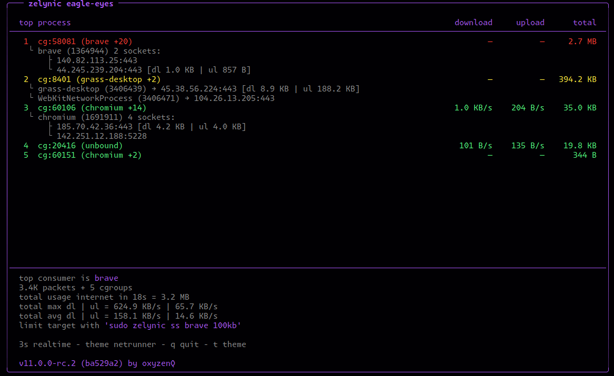
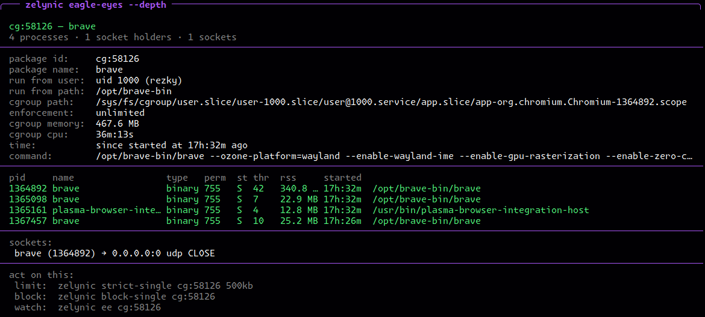

<!-- Copyright (C) 2026 rezky_nightky -->
<!-- SPDX-License-Identifier: GPL-3.0-only -->

<p align="center">
  
</p>

<h1 align="center">zelynic</h1>

<p align="center">
  <strong>Per-app network rate limiter and traffic monitor for Linux. Pure eBPF. Boring and silent but killer.</strong>
</p>

<p align="center">
  One of the first open-source Linux bandwidth managers built around a pure eBPF datapath
  with per-application rate limiting, live traffic monitoring, fractional precision, and
  zero-daemon enforcement.
</p>

<div align="center">

> Run anything you like. Launch whatever you want.
> The cosmic dragon counts every byte that leaves the den — and the ledger never lies.

</div>

<p align="center">
  <a href="https://github.com/oxyzenQ/zelynic/releases">
    
  </a>
  <a href="https://ko-fi.com/rezky">
    
  </a>
</p>

## Demo

<!-- Screenshot assets: the rendered TUI is capture-dependent (terminal
     geometry, theme, live cgroup population). The text contract —
     USAGE.md's sample blocks and the pinned test family — is the
     source of truth; the screenshots follow at the next owner-host
     capture session. The standing disclaimer rule (docs/README.md)
     owns the class. -->

<p align="center">
  
</p>

<p align="center">
  
</p>

## Why zelynic?

Traditional tools limit interfaces. zelynic limits **applications**.

Brave can be limited to 100 KB/s while Firefox runs at full speed — all on the
same WiFi interface. No `tc`, no `nftables`, no `LD_PRELOAD`, no daemon.

### What makes zelynic sharp

Every claim below maps to a mechanism that verifies it — the full
ledger (live proof harness, rootless pins, CI surfaces, and the
honest residuals) lives in
[docs/CLAIMS_VERIFICATION.md](docs/CLAIMS_VERIFICATION.md).

| Edge | Detail |
|------|--------|
| **Pure eBPF datapath** | Zero intermediaries. The kernel IS the rate limiter. |
| **Subtree-aware limits** | A limit on a cgroup covers every process spawned beneath it — any depth, born any time, sharing ONE budget (AMMSP, NIGHT-private-research-2). tc/nftables can't see the cgroup tree; zelynic polices it. |
| **Guaranteed fair share** | `--floor 100kb` / `--ceil 300kb`: every subprocess under the target is guaranteed a minimum and capped at a maximum — the floor a PRIORITY (an idle subprocess lends its share back; the pool itself is the lender), the ceiling binding even a lone subprocess. HTB's rate/ceil idiom in a pure eBPF policer (improve-40, schema v24). Per-direction spellings for the asymmetric link: `--floor-download` / `--ceil-upload` bracket one direction's rows only, one spelling per side (improve-40-b). |
| **Self-expiring limits** | `--during 20d` — a duration from the apply instant (units s, m, h, d, mn, y; bounds 1s..5y): the KERNEL expires the row, no daemon, no cron, drift-free monotonic spans (night-during, schema v23; the window and date forms are gone — the owner's duration-only revision, rows written by older builds keep their promises). |
| **Pinned bpf_links** | Enforcement survives process exit — no daemon, no battery drain (RAM/CPU/IO measured live, not asserted: the proof harness's footprint claim). |
| **Fractional precision** | 0.00% measured rate error, sub-byte token accumulation (reproduce: `sudo ./scripts/bench/proof-claims.sh`; math pins: test/ebpf/limiter/math_tests.rs). |
| **Schema migration** | BPF struct changes auto-detected + auto-cleaned on upgrade. |
| **Crash recovery** | `zelynic recover` detects + removes orphaned BPF pins. |
| **Discovery workflow** | `zelynic eagle-eyes` (live box) finds bandwidth hogs — other limiters can't discover. |
| **Box mode** | In-place refresh, clean exit, responsive layout; selection/copy physics documented in the [USAGE FAQ](docs/USAGE.md#faq) (NIGHT-hunt-7, improve-7/8). |
| **Unified monitor** | `eagle-eyes` runs live until you press `q` — apps ranked by session accumulation, rows persist through quiet frames, rank 1 wears champion red (NIGHT-boost-5). |
| **Diff-based rendering** | Only changed rows are emitted — one write syscall per frame, idle frames cost zero I/O (NIGHT-improve-2). |
| **Refresh control** | `--interval 1s..60s` on `eagle-eyes`, live DOWNLOAD/UPLOAD rate columns plus a session TOTAL, and the footer's session speed pair — `peak arrival dl | ul` / `avg arrival dl | ul` per direction (NIGHT-engrave-6, arrival-labeled by night-private-research-7). |
| **Eagle-eyes detail** | Monitor rows name the processes and endpoints INSIDE a cgroup — `curl (4012) -> 142.250.191.78:443` (NIGHT-hunt-8). |
| **Depth traffic focus** | `ee <target> --depth` MEASURES a focus window (default 3s, `--focus 1s-30s`) and prints what moved per endpoint with the kernel's own window totals — movers ranked first (NIGHT-private-research-3). |
| **Strict dependency diet** | 7 direct deps, 54 lockfile crates, every one justified in [docs/DEPENDENCY_AUDIT.md](docs/DEPENDENCY_AUDIT.md). |

### Dependency policy (supply chain)

Dependencies are attack surface (NIGHT-hunt-6): every direct dependency
needs live call sites recorded in
[docs/DEPENDENCY_AUDIT.md](docs/DEPENDENCY_AUDIT.md), features are trimmed
to what is actually used, and time crates are banned (`-V`'s build stamp
is computed in `build.rs`). `cargo deny check all` runs over the full
feature graph in CI — the rules and evidence live in the audit doc and
[CONTRIBUTING.md](CONTRIBUTING.md), told once there.

### vs traditional tools

| Tool | Technology | Per-app? | Daemon? | Precision |
|------|-----------|----------|---------|-----------|
| `tc` | HTB/TBF qdisc | Per-interface | No | Integer |
| `nftables` + `tc` | Mark + shape | Complex setup | No | Integer |
| `wondershaper` | tc wrapper | Global only | No | Integer |
| `trickle` | LD_PRELOAD | Dynamic only | No | Integer |
| **zelynic** | **Pure eBPF** | **Per-cgroup** | **No** | **0.00%*** |

\* A measurement, not a promise — the proof harness's verdict on the
tested kernels. Reproduce it: `sudo ./scripts/bench/proof-claims.sh`
(the residual prints next to the verdict; the full ledger lives in
[docs/CLAIMS_VERIFICATION.md](docs/CLAIMS_VERIFICATION.md)).

## Quick Start

New here? Skim the [Complete Usage Guide](docs/USAGE.md) — especially its
[honest limitations](docs/USAGE.md#honest-limitations--read-this) section
before relying on a limit.

### Requirements

- Linux kernel 5.13+, cgroup v2, root — the full matrix and why each
  piece is needed: [docs/KERNEL_COMPATIBILITY.md](docs/KERNEL_COMPATIBILITY.md)
- Python 3 for the test/benchmark scripts (stdlib only)

Unsure about your kernel? `zelynic doctor` says yes or no with the exact
reason — and since NIGHT-dinner-3 it answers the other half of the
question too: the `Build:` line reports whether the binary itself is
**full-life** (eBPF objects embedded, ready to enforce) or **half-life**
(userspace-only build — every eBPF surface, the live monitor included,
answers its honest refusal; only doctor and help run), so a
downloaded or `cargo install`ed binary identifies itself in one command
— and since night-improve-66 the BUILD block under it names the exact
artifact: version, commit, variant, build time, the rustc that
compiled it, and the optimization profile
([Kernel Compatibility](docs/KERNEL_COMPATIBILITY.md) has the full
matrix and troubleshooting).

### Install from a release (recommended)

Each release is a flat three-file tarball — `zelynic`, `README.md`,
`LICENSE`, nothing else (the cosmostrix release invariant): the
pure-Rust eBPF objects are embedded in the binary, so no toolchain,
no clang, no cargo, and no installer is needed on the target machine.

Releases are arch-baseline builds (NIGHT-improve-22, cosmostrix
pro-linux lineage): every package is x86-64-v3 (AVX/AVX2/BMI1/BMI2/
FMA — any x86_64 CPU from ~2013 Haswell onward) or x86-64-v4
(AVX-512), in both libc flavors — four packages per tag, and only
those four. The native v1 baseline is retired from releases: every
CPU that can run a release at all can run v3, and v3's vector paths
are what the limiter's hot loops actually use. Pick `gnu` normally,
`musl` for old glibc systems (fully static):

```bash
mkdir /tmp/zelynic-rel
# v3 runs on any x86_64 machine from ~2013 onward:
tar -xzf zelynic-vX.Y.Z-linux-amd64-v3-gnu.tar.gz -C /tmp/zelynic-rel
# AVX-512 machines (Zen 4/5, Ice Lake and newer): -v4-gnu
# old glibc / fully static: -v3-musl / -v4-musl

# user install
install -Dm755 /tmp/zelynic-rel/zelynic ~/.local/bin/zelynic
# or: sudo install -Dm755 /tmp/zelynic-rel/zelynic /usr/local/bin/zelynic
```

Every package name carries its libc leg (NIGHT-boost-36): the four
tarballs are `zelynic-vX.Y.Z-linux-amd64-v3-gnu.tar.gz`, `-v4-gnu`,
`-v3-musl`, and `-v4-musl` — the same id the binary inside reports
in `Build:` (`linux-amd64-v3-gnu`): one string names the download and
the binary's own self-description, so the two can never drift.

Not sure which baseline your CPU takes? `grep -o 'avx512f'
/proc/cpuinfo` answers v4 eligibility — any hit means yes, everything
else takes v3.

Uninstall is `rm` on the binary — the release payload is that one
file, so there is nothing else to clean (no /usr/lib payload, no
service, no man page). Building from source keeps the richer
`scripts/package/install.sh` / `uninstall.sh` flow in the repo.

Each release tarball carries three checksums (SHA-512 + BLAKE2b-512 +
SHAKE256) and a detached GPG signature from the maintainer's
published key. Verify before installing — the one-liners live in
[Release Verification](#release-verification) below and in
[docs/VERIFY_RELEASE.md](docs/VERIFY_RELEASE.md), told once there.

### Install from crates.io

`cargo install zelynic --locked` builds from the published source
tarball and lands the **full-featured binary** — monitor and limiter,
eBPF objects embedded — on a plain **stable toolchain: no nightly, no
bpf-linker, no bootstrap** ever touches the installing machine
(NIGHT-ask-2). The detached `ebpf/` workspace still cannot ride a
registry tarball (cargo's package walk auto-excludes nested packages,
verified live), so the crate ships **`ebpf-prebuilt/`** instead: the
two maintainer-built objects — the same bytes the release tarballs
above embed, so kernel compatibility is identical — which build.rs
stages for the default `ebpf` feature. `zelynic -V` answers with the
exact source sha under the full-life Signature line, `zelynic doctor`
names the lane — `registry-prebuilt` (text and JSON) — and the
provenance (source-tree hash, toolchain, linker, per-object sha256)
rides the tarball as `ebpf-prebuilt/manifest.toml`. The dormant lane
(stable binary, eBPF surfaces disabled) survives as the explicit
opt-out: `--no-default-features`. Cargo verifies the tarball SHA-256
against the registry index before extraction, the publish is
`--locked` to the tagged `Cargo.lock`, and after any change under
`ebpf/` the parity gate fails until the maintainer refreshes the
prebuilt lane — enforced at commit time (a self-installing
pre-commit hook), at push time (the wholesale Dragon Guard
workflow), and at ship time (parity steps in the release and
crates.io publish pipelines). The full channel contract lives in
[docs/VERIFY_RELEASE.md](docs/VERIFY_RELEASE.md) (section 4, with the
owner's first-publish manual).

### Install from source

Lazy? Skip the manual order entirely — one command runs the WHOLE
bring-up (bootstrap + pro-native-gnu build + engine self-test + the
full supermassive matrix) and ends with a next-steps menu
(NIGHT-improve-18):

```bash
./scripts/setup.sh               # everything
./scripts/setup.sh --musl        # also build the static musl twin
./scripts/setup.sh --skip-heavy  # bootstrap + build + self-test only
```

The whole bring-up-plus-batteries flow runs on CI too (NIGHT-ultimate-3,
the re-issued label; consolidated in NIGHT-improve-31; the kernel
span + dynamic envelopes are NIGHT-improve-33): a push touching
core files triggers `.github/workflows/supermassive.yml`, which runs
this exact owner-facing path (`setup.sh` itself, not a CI-shaped
shortcut) and then the supermassive batteries inside a KVM micro-VM
on a hosted runner, under two resource envelopes derived at boot
time from whatever runner the job lands on (the owner's "don't set
fixed, let dynamic"; the small envelope is renamed low —
NIGHT-blade-3): "supermassive test - low specs" (a quarter of the
cores floored at 1 + an eighth of the RAM floored at 1024 MB, the
dense-little-host slice, booting the TRUE documented floor kernel —
impish indri 5.13, the oldest kernel in the verified matrix, from
the frozen old-releases archive) and "supermassive test - best
specs" (every core + three quarters of the RAM, the big-host width,
booting the Ubuntu archive's LATEST kernel, resolved dynamically at
run time — nothing pinned, the resolver walks onto each new release
by itself). Each envelope is crossed with the payload's libc
(NIGHT-blade-12, the "low/best with musl version" ask): four legs
total — the musl legs keep the static twin on the frozen
ubuntu:22.04 userland it has always ridden, and the gnu legs boot
the pro-native-gnu flagship on a ubuntu:24.04 rootfs (same-distro
as the runner that built the dynamic binary), so the default
source-build shape finally gets the live batteries — limiter
matrix, survival, rig suites (the three root rigs, NIGHT-hunt-35),
claims proof — that the static twin had alone.
So "does it work end to end?" is answered per push across the whole
kernel span AND the machine span AND both libc flavors — no
VirtualBox session needed; `workflow_dispatch` fires the same four
legs on demand as the pre-release qualification run, and a weekly
run keeps the span proven between pushes (a plain container cannot
change the host kernel; the micro-VM is the honest container-shaped
answer).

Building needs the pinned Rust toolchain (rustup installs the exact
version from `rust-toolchain.toml`) plus the eBPF nightly pair — and
one command readies the whole host: the prerequisites, the PATH fix,
and the flagship binary itself (NIGHT-improve-16):

```bash
git clone https://github.com/oxyzenQ/zelynic.git
cd zelynic

# One-time host setup, COMPLETE: the dated nightly pin from
# ebpf/rust-toolchain.toml + the bpf-linker 0.11.1 prebuilt into
# ~/.local/bin (no sudo, no system LLVM) + the PATH fix persisted
# to ~/.profile + the flagship build — bootstrap ends ready to test:
./scripts/dev/bootstrap-ebpf.sh
# (binary lands in target/pro-native-gnu/zelynic)

# Plain release-profile build (the manual alternative — the BPF
# objects are built pure-Rust, aya-ebpf nested nightly build in
# build.rs, and embedded into the binary):
cargo build --release --features ebpf
```

#### Native-CPU host builds

For a binary compiled specifically for the host CPU (maximum
performance on the machine it runs on, cosmostrix `pro-native`
lineage):

```bash
# Dynamic linking (glibc) — lands in target/pro-native-gnu/zelynic
cargo pro-native-gnu

# Static linking (musl) — lands in
# target/x86_64-unknown-linux-musl/pro-native-musl/zelynic
cargo pro-native-musl
```

Both aliases build the full flagship binary (`--features ebpf`,
same optimization tier as release) with `-C target-cpu=native`, and
report their build label in the version output:

```bash
$ ./target/pro-native-gnu/zelynic -V
Build: local-native-gnu (<hash>)
Build-time: 9/18/2026 01:30 (UTC)
Signature: Pure eBPF builtin — Official Build by rezky_nightky (oxyzenQ)
```

The `Build-time` line is stamped at compile time in `build.rs` — UTC
only, no time crate in the dependency tree (see the
dependency policy above).

A native build never clobbers `target/release/zelynic` — the separate
profile names keep both binaries side by side. The `-C
target-cpu=native` tune applies to the host binary only: build.rs
strips host-CPU and host-linker rustflags from the nested eBPF
build's environment before invoking it (NIGHT-hunt-28), so the bpfel
objects are identical no matter which alias built them. Note: a
native binary only runs on the CPU family it was compiled for; ship
the arch-baseline release packages for distribution.

#### Arch-baseline release builds (v3 / v4)

The release packages' exact shapes, locally (NIGHT-improve-22,
cosmostrix pro-linux lineage) — full flagship binary (`--features
ebpf`), same optimization tier as release, a `-V` build label that
names the shape, and a separate profile per shape so nothing
clobbers anything:

```bash
cargo pro-linux-amd64-v3-gnu  # target/pro-linux-amd64-v3-gnu/zelynic
cargo pro-linux-amd64-v4-gnu  # target/pro-linux-amd64-v4-gnu/zelynic
cargo pro-linux-amd64-v3-musl # target/x86_64-unknown-linux-musl/pro-linux-amd64-v3-musl/zelynic
cargo pro-linux-amd64-v4-musl # target/x86_64-unknown-linux-musl/pro-linux-amd64-v4-musl/zelynic
```

Each alias injects `-C target-cpu=x86-64-v3` (or `-v4`) — plus
`-C target-feature=+crt-static` on the musl pair — so a local build
reproduces the release artifact's optimization tier bit-for-bit
(same flags the release workflow composes). build.rs strips the
baseline flags from the nested eBPF build (NIGHT-hunt-28), exactly
as for the native aliases, so the bpfel objects stay identical
across all six build shapes. A v3 build runs on any x86_64 CPU from
~2013 onward; a v4 build needs AVX-512 (check with `grep -o
'avx512f' /proc/cpuinfo`).

`scripts/package/install.sh` builds through the same alias — default
`cargo pro-native-gnu`, `--musl` for the static x86_64 build — and
verifies the binary answers `-V` before anything is installed
(NIGHT-improve-15). `scripts/package/uninstall.sh` clears kernel enforcement
first: while BPF pins are still live under `/sys/fs/bpf/zelynic` it
runs `u --all` (or prints the exact manual steps when no binary
is left) before deleting files, so active limits never outlive the
tool that can remove them.

### Usage

Every command, once — flags live in `--help`, formats in
[Rate Formats](#rate-formats), the full workflows in
[docs/USAGE.md](docs/USAGE.md):

```bash
# Limit one app — positional rate sets BOTH download + upload
# (NIGHT-improve-53: one verb per family; 's' is the short form)
sudo zelynic strict brave 100kb
# per-direction
sudo zelynic strict firefox -d 1mb -u 500kb

# Group limit — several apps share ONE rate; the '::' separator
# never collides with the single ':' the cg: prefix and the
# container URIs (docker://nginx) own
sudo zelynic s brave::curl::pacman 1mb

# Every user app at once (system apps excluded unless --force-this)
sudo zelynic s --all 500kb

# Block apps from the internet entirely — one target or a '::' list
sudo zelynic block brave
sudo zelynic b brave::curl
sudo zelynic b --all

# Live monitor (box mode, q to quit) — apps ranked by consumption,
# one target opens the deep focus view
sudo zelynic eagle-eyes --interval 2s
# zoom into one cgroup
sudo zelynic eagle-eyes 73386
# watch one app, deep view
sudo zelynic eagle-eyes brave

# One-shot deep inspection (NIGHT-master-1): what IS this cgroup —
# user, binary/script, permissions, path, start time, enforcement
sudo zelynic ee cg:1234 --depth
# ...with the network-traffic focus window (NIGHT-private-research-3):
# per-endpoint bytes + kernel window totals, movers ranked first
sudo zelynic ee cg:1234 --depth --focus 5s
sudo zelynic ee 12345 --depth --print-json | jq '.targets[0]'

# Unlock — one app / a group / everything (same verb, same law)
sudo zelynic unstrict brave
sudo zelynic u brave::curl
# emergency reset
sudo zelynic u --all

# Short aliases (NIGHT-improve-53/54): s b u ee
# strict brave 100kb
sudo zelynic s brave 100kb
# eagle-eyes brave --interval 1s
sudo zelynic ee brave --interval 1s

# State: active limits, apps with cgroup IDs, eBPF support
sudo zelynic status --print-json | jq '.limits[]'
sudo zelynic list-apps
sudo zelynic doctor

# Recover from a crash (clean orphaned BPF pins)
sudo zelynic recover
```

A target that matches nothing is a hard error — red `error:` block,
exit 1 — so a typo'd `ss cg8401` can never read as success (the
eBPF-verifier lineage: reject, never half-apply). The status table's
`allowed` / `dropped` columns are cumulative bytes per cgroup since
the limit was set — allowed passed the token budget, dropped exceeded
it (the sender retransmits, so it reappears in allowed later);
`unstrict` clears both.

Monitors are always live; the CLI surface is frozen (v11) — the
removed surfaces (`man`, `completions`, `unblock`, `limit-all`/`la`,
`-i`, `--live`, `--duration`) exit with a usage error on
purpose (the retired `limit-all` spelling redirects to the
`s --all` sweep, NIGHT-blade-2/improve-54; the `-all` verbs
themselves retired into the family verbs' `--all` lanes in
NIGHT-improve-54 — `strict-all`/`sa`, `block-all`/`ba`,
`unstrict-all`/`ua` all redirect; the `--info` alias of
`eagle-eyes --depth` returned
at NIGHT-master-1 and is retired again in NIGHT-blade-4 — `--depth`
is the one spelling, and the short `-i` stays retired). Command
semantics, quit keys, and recipes: [docs/USAGE.md](docs/USAGE.md);
`--help` is the single flag reference.

Global flags work on every command: `-v/--verbose` (diagnostic trace),
`--print-json`, `--help`, `-V/--version`, and `--check-update` — which
**refuses to run as root** (a plain network fetch must not ride sudo;
full privilege matrix: [docs/SAFETY_ANALYSIS.md](docs/SAFETY_ANALYSIS.md)).

## Rate Formats

Lowercase units only (decimal SI: 1 KB = 1000 bytes):

| Format | Meaning |
|--------|---------|
| `500b` | 500 bytes/second |
| `100kb` | 100 kilobytes/second |
| `1mb` | 1 megabyte/second |
| `1gb` | 1 gigabyte/second |
| `100gb` | 100 gigabytes/second |
| `1tb` | 1 terabyte/second |

**Bounds**: minimum 1 KB/s, maximum 1 TB/s, both overridable with
`--force-this` (told once — parsing details and error tips live
in `--help` and [docs/USAGE.md](docs/USAGE.md)).

Monitor `--interval` accepts the same duration formats, bounded to
1s..60s (a live monitor is neither a spam flood nor a screenshot) —
see [docs/USAGE.md](docs/USAGE.md) `eagle-eyes`.

## Limitations (honest)

zelynic is deliberately small and stateless — the full eleven-item
list, with examples and the exact snapshot rule, lives in
[USAGE.md](docs/USAGE.md#honest-limitations--read-this). In one
breath: rules are a snapshot (new apps need a re-run), limits do not
survive reboot, name resolution needs the app running, one name can
match several cgroups, rates are decimal SI per direction, monitoring
surfaces need root too, and status counters are cumulative evidence.

### The nightly eBPF toolchain (honest)

The eBPF build dependencies (`aya-ebpf` on a pinned nightly rustc,
plus bpf-linker) are experimental — but they are quarantined at
BUILD time. The BPF objects are cross-compiled, validated, and
embedded inside the single release binary, so a deployment needs
only a kernel and the one file: no rustup, no nightly, no LLVM.
Production stability rests on the kernel's eBPF UAPI, the most
stable ABI Linux maintains — not on the Rust nightly train.
The full layering, the LTS isolation contract, and the residual
limits (with their exact cost and first commands) live in
[docs/STABILITY.md](docs/STABILITY.md): **99% production-useful,
and the missing 1% fails closed and says so.**

## Safety Features

- **Rate bounds guard**: 1 KB/s..1 TB/s, `--force-this` overrides
- **Fail-safe BPF**: returns "allow" on any error path (never blocks on failure)
- **Dangerous target protection**: 57 system processes blocked by default
  — the list ships in source (`src/commands/safety.rs`,
  `DANGEROUS_TARGETS`), and `--help` prints the count live from it, so
  the number cannot drift
- **Overflow detection**: absurd rates show a friendly warning, not wrapped values
- **File lock**: prevents concurrent operations from corrupting BPF state
- **Kernel version detection**: graceful fallback for kernel < 5.7 (legacy bpf_prog_attach)

(Fire-and-forget, crash recovery, and schema migration are already in
the feature table above; the full audit trail is
[docs/SAFETY_ANALYSIS.md](docs/SAFETY_ANALYSIS.md).)

## Architecture

**The cosmic dragon architecture** — pure eBPF, no intermediaries:

```
┌───────────────────────────────────────────────────┐
│  Layer 4 — CLI                                    │
│  strict / block / eagle-eyes / status             │
├───────────────────────────────────────────────────┤
│  Layer 3 — Aggregation (delta, sort, format)      │
├───────────────────────────────────────────────────┤
│  Layer 2 — Identity (/proc → cgroup ID)           │
├───────────────────────────────────────────────────┤
│  Layer 1 — Map Interface (aya, pinned maps)       │
├───────────────────────────────────────────────────┤
│  Layer 0 — BPF (kernel)                           │
│  cgroup_skb/ingress + cgroup_skb/egress           │
└───────────────────────────────────────────────────┘
```

## Philosophy

**Boring and silent but killer.**

zelynic is a Linux utility that stays out of the user's way while
doing serious work underneath. The interface rarely changes. Features don't
explode. Every release makes it slightly more stable, slightly faster,
slightly easier to maintain.

### What zelynic IS

- **Single CLI binary** — no daemon, no service, no config file
- **Pure eBPF** — no tc, no nft, no wrappers
- **Small codebase** — minimal dependencies, easy to audit
- **Predictable behavior** — same input → same output, every time
- **Linux-only at runtime** — the `ebpf` feature is a no-op
  elsewhere; BSD/macOS and Windows are out of scope, ever

### What zelynic will NEVER be

- No Bloat TUI (minimal TUI only for focus monitoring)
- No systemd service dependency
- No `config.toml` (CLI flags only)
- No daemon mode
- No REST API
- No non-Linux support

### Stable API (from v50.0.0)

The CLI surface is frozen. No breaking changes
to commands, flags, or output format. Future releases focus on:

- Bug fixes
- Kernel compatibility updates
- Performance improvements (internal, no API changes)

### Maintenance Mode (from v50.0.0)

> **zelynic marks the beginning of maintenance mode. Future releases
> prioritize stability, compatibility, performance, and bug fixes over
> feature expansion.**

No new features unless critical for security or compatibility.
Release cadence slows to "when needed".

### Release channels

Stable releases are tagged `vX.Y.Z`. Pre-release builds are restricted to
five channels — `dev`, `nightly`, `alpha`, `beta`, `rc` (e.g. `v1.0.0-dev.1`,
`v1.0.0-rc.1`). CI rejects any other suffix and never marks a pre-release
as "latest".

## Branches

| Branch | Purpose | Status |
|--------|---------|--------|
| `main` | Pure eBPF (the cosmic dragon architecture) | Maintenance mode |

## Contributing

PRs and issues are welcome. The bar is the gate suite — build, test,
conventions, and the full script inventory are documented once in
[CONTRIBUTING.md](CONTRIBUTING.md); project conventions also live in
[docs/RULES.md](docs/RULES.md). Contributions land under the
[Contributor License Agreement](CLA.md) — the dual-license offer needs
the relicensing grant, and the DCO-style `Signed-off-by:` line on your
commits (`git commit -s`) is the acceptance; no separate signature.

## Security

zelynic runs as root and programs the kernel datapath, so security is
part of the product. Found something? **Report it privately** — the
policy, supported versions, and what counts as a vulnerability live in
[SECURITY.md](SECURITY.md); the audit trail and the privilege matrix
(who needs root where, and the one surface that refuses it) live in
[docs/SAFETY_ANALYSIS.md](docs/SAFETY_ANALYSIS.md).

## Documentation

- [Complete Usage Guide](docs/USAGE.md) — every command, workflows, honest limitations, troubleshooting (the flagship reference)
- [Security Policy](SECURITY.md) — reporting, scope, supported versions
- [the cosmic dragon architecture](docs/COSMIC_DRAGON_ARCHITECTURE.md) — design + principles
- [Kernel Compatibility](docs/KERNEL_COMPATIBILITY.md) — requirements + distro matrix
- [Performance Metrics](docs/PERFORMANCE.md) — deep benchmark results + targets
- [Cross-Distro Results](docs/CROSS_DISTRO_RESULTS.md) — the 6-distro validation record
- [Dependency Audit](docs/DEPENDENCY_AUDIT.md) — every direct dependency justified
- [Release Verification](docs/VERIFY_RELEASE.md) — GPG signature + checksum verification
- [Contributing Guide](CONTRIBUTING.md) — gates, conventions, script inventory
- [Contributor License Agreement](CLA.md) — the CLA terms and the DCO sign-off acceptance
- [Licensing FAQ](docs/LICENSING_FAQ.md) — dual-licensing questions answered
- [Commercial License](COMMERCIAL_LICENSE.md) — tiers, pricing, payment, verification
- [Q&A Record](QA.md) — owner questions answered against the source (ask-mode sessions)

The rest of the shelf — the [FAQ](docs/FAQ.md), the
[philosophy](docs/PHILOSOPHY.md) and [branding](docs/BRANDING.md)
records, the owner's [maintenance playbook](docs/MAINTENANCE.md),
and the dated research set (the [pure-Rust eBPF
evaluation](docs/PURE_RUST_EVALUATION.md), the [toolchain and
monitoring research](docs/RESEARCH_TOOLCHAIN_AND_MONITORING.md)) —
is cataloged once in the master index,
[docs/README.md](docs/README.md): one row per question, every doc
named there.

## Test Results

Verified on 6 distributions — every one passed the depth and leak
suites (Fedora's four leak rows were bpftool false positives, kept
verbatim in the record), and real enforcement was measured against
live browsers. Honest context for the rows: they are 2026 runs — the
kernel 7.x and Ubuntu 26.04 entries are the current 2026 release
lanes, not typos — one row on bare metal, one on a Live ISO, four in
QEMU/KVM VMs, and all measured the pre-phase-3 tarball (the
self-contained binary came after). Today the CI lane re-validates
the current binary on every core push. The full record, per-distro
details, and the accuracy table live in
[docs/CROSS_DISTRO_RESULTS.md](docs/CROSS_DISTRO_RESULTS.md), told
once there:

| Distro | Kernel | Binary | Enforcement |
|--------|--------|--------|-------------|
| Arch Linux | 6.18 | GNU | brave 100kb → 730 Kbps |
| CachyOS VM | 7.1 | MUSL | chromium 360kb → 3.0 Mbps |
| Ubuntu 26.04 | 7.0 | GNU | firefox 100kb → 650 Kbps |
| Fedora 44 | 6.19 | GNU | firefox 100kb → 690 Kbps |
| Ubuntu 21.10 | 5.13 | MUSL | GeckoMain 100kb → 770 Kbps |
| Debian 13 | 6.12 | MUSL | firefox-esr 900kb → 7.0 Mbps |

Every harness below is one command — stdlib-only Python, loopback
traffic, no external test server — and every root-requiring one has a
rootless `--self-test` engine smoke. Each also takes `--quick` for
faster windows. The table is the map; the design notes and audit
trails live in each row's doc, told once there:

| Harness | What it proves | One command |
|---------|----------------|-------------|
| [depth](docs/CROSS_DISTRO_RESULTS.md) | Rate accuracy, kernel-drop proof, BPF accounting, residue — on your machine or any distro (~2 min) | `sudo ./scripts/depth/limiter-depth-test.sh` |
| [endurance](docs/STABILITY.md) | The ultra-long horizon: the LTS map budget under 300 churn cycles, a monitor soaked flat, zero residue (~100s) | `sudo ./scripts/depth/endurance-test.sh` |
| [supermassive v1](docs/CROSS_DISTRO_RESULTS.md) | Every stage that measures a LIMIT: the 64-cgroup server fleet, then the full desktop matrix (6+ min) | `sudo ./scripts/supermassive/supermassive-test.sh` |
| [supermassive v2](docs/CROSS_DISTRO_RESULTS.md) | The abuse family: the 106-case CLI stresstest, guards, SIGKILL batteries, crash teardown (4+ min) | `sudo ./scripts/supermassive/supermassive-test-v2.sh` |
| [supermassive v3](docs/CROSS_DISTRO_RESULTS.md) | The container depth: docker:// and k8s:// target grammar, resolution errors, the resolve-only contract, docker E2E (self-skips with no daemon) | `sudo ./scripts/supermassive/supermassive-test-v3.sh` |
| [supermassive v4](docs/CROSS_DISTRO_RESULTS.md) | The CLI depth: every command, alias, flag, color mode (zero to hero), typo tip, rate-explode category, removed/retired + hidden surface (rootless) | `./scripts/supermassive/supermassive-test-v4.sh` |
| [AMMSP vs legacy](docs/CROSS_DISTRO_RESULTS.md) | The subtree contract as a DELTA: this build vs the pre-AMMSP v11.0.0 stable, seven child leaves each, the >= 99% coverage proof (~3 min) | `sudo ./scripts/supermassive/ammsp-vs-legacy-test.sh` (the v11.0.0 side auto-downloads, sha512-verified) |
| [claims proof](docs/CLAIMS_VERIFICATION.md) | The README's four headline claims plus the one-shot footprint, proven live (~1 min) | `sudo ./scripts/bench/proof-claims.sh` |
| [sandbox](docs/SANDBOX.md) | No root on your box? The same micro-VM CI boots, locally — throwaway kernel, no docker, no host changes | `scripts/sandbox/zelynic-sandbox.sh --smoke` |

Three facts that shape a run. The server phase always runs FIRST and
gates the desktop matrix — a machine that cannot hold the server
shape does not get to the desktop legs. The v1/v2/v3/v4 split is
deliberate: v1 owns every stage that measures a limit, v2 owns the
abuse family, v3 owns the container surface, v4 owns the CLI surface —
green on all four is the full verdict. And the claims harness runs a
version gate: it refuses any binary whose `-V` doesn't match the
checkout's Cargo.toml, so a stale distro install can never masquerade
as the build under test.

No machine handy at all? The whole qualification — bring-up, v1, v2,
v3, v4, in that order — runs on CI on every core-file push (real sudo,
real BPF, real runner kernels, no container), and the 5.15 floor lane
is proven by its own KVM micro-VM workflow. The v3 container E2E lanes
(docker + k8s via kind) run on their own CI workflow against real
runtimes — the micro-VM pair ships no docker daemon and no kubelet, so
the container-native round trip (resolve `docker://`/`k8s://` to a real
cgroup, enforce, teardown) has its own honest lane. A green Actions run
is the same verdict these commands produce locally.

## Release Verification

Each release ships a **detached GPG signature** per archive plus three
checksums: classical SHA-512 + quantum-resistant BLAKE2b-512 +
SHAKE256. The authenticity check is one command —

```bash
# one-time: import the maintainer's published signing key
gpg --keyserver keyserver.ubuntu.com \
  --recv-keys F5324E0967F104D58CE025F347A50AEF4B65AAC2

# per download: prove the tarball came from the maintainer
gpg --verify zelynic-vX.Y.Z-linux-amd64-v3-gnu.tar.gz.asc
```

— and the checksum one-liners, the key details, and the algorithm
rationale live in [docs/VERIFY_RELEASE.md](docs/VERIFY_RELEASE.md),
told once there.

## Support

zelynic is an open-source project built and maintained independently —
the [Author](#author) section below says who by.

If this project helped you, or tamed your bandwidth, you can support future maintenance here:

[](https://ko-fi.com/rezky)

### Crypto donations

Owner-verified receive addresses. All three passed offline cryptographic verification (EIP-55 mixed-case checksum for Ethereum, bech32m witness-v1 for Taproot, base58-to-32-byte ed25519 key for Solana). Always double-check the address on screen before sending — network mismatches (e.g., sending USDT-ERC20 to a Solana address, or sending BTC to a non-Taproot address) will permanently lose funds.

- **Solana** — `SOL` / `USDT` (SPL) on Solana mainnet: `88umzS7abaToaGQVgTVXt5SnuvcjTw2jPSM6Ha2JYmXM`
- **Ethereum** — `ETH` / `USDT` (ERC-20) / `USDC` (ERC-20) on Ethereum mainnet: `0x1bCbA21c07B5636a942De27AA7Ee8283cEDb4C3D`
- **Bitcoin** — `BTC` on Taproot (P2TR, bech32m, `bc1p`-prefixed — verified Taproot, not native SegWit): `bc1p88nqysn4p8u9zxwz2pyxs5pl77wllcrk6ca2r2l3ryr3863hxkys5vdkze`

Support is optional. The project remains open-source.

## Intellectual Property & Trademark

**zelynic** and its Marks (the name, logo, and branding) are governed by
[TRADEMARK.md](TRADEMARK.md). The Marks are NOT covered by the source
license and are reserved by the owner. This project is **NOT for sale** —
unauthorized rebranding, relicensing, or source-code theft is strictly
prohibited.

**Forking policy** — two categories with different rules (full text in
[TRADEMARK.md §4](TRADEMARK.md)):

- **Contribution forks** (bug fixes, features, PRs back to upstream): allowed without permission. Keep the zelynic name, logo, and branding unchanged — no rename or rebrand required. Just open a PR.
- **Non-contribution forks** (rebrand, relaunch, derivative product, commercial offering): require owner discussion first. MUST use a different project name + different branding. Open a GitHub Issue before public release.

For trademark licensing or written permission, see
[TRADEMARK.md §6](TRADEMARK.md) — the contact channels live there, told
once.

## Commercial Licensing

Companies using this in production need a commercial license.

zelynic is dual-licensed: **GPL-3.0-only** for open-source use, and a
**Commercial License** for proprietary and commercial use (SaaS offerings,
internal tools that cannot meet copyleft, redistribution under your own
terms). Full details, payment instructions, and the verification process
live in [COMMERCIAL_LICENSE.md](COMMERCIAL_LICENSE.md); the short version:

| Tier       | Price          | Target                                           |
| ---------- | -------------- | ------------------------------------------------ |
| Personal   | Free (GPL-3.0) | Hobby, personal, non-commercial, contributions   |
| Individual | $99/year       | Solo devs, freelancers, revenue < $100K/year     |
| Business   | $2,199/year    | SMB, revenue $100K – $10M/year                   |
| Company    | $20,199/year   | Enterprise (>$10M/year) OR redistribution rights |

The business end of the ladder follows the value upward
(NIGHT-dinner-25): zelynic is a masterpiece, and its value
increases year by year — the price tracks the value, and it will
keep rising as the work compounds. Buyers who paid before the
move are grandfathered at the price they bought, for the term
they bought.

**Unauthorized use is theft.** Taking this code — stealing it,
forking it illegally, stripping the license, or building a
closed-source commercial product on it — without first
contacting the owner (rezky_nightky / oxyzenQ) and paying the
license is, in the owner's own words, the mark of the worst
kind of human — a rotten one. The honest paths are exactly two:
comply with GPL-3.0-only (free, first-class, not a trial), or
buy the tier your revenue honestly matches. There is no third
path that leaves you clean.

Tiers are self-declared in good faith. Payment is USD-pegged crypto
(Solana / Ethereum / Bitcoin, owner-verified addresses with QR codes —
see COMMERCIAL_LICENSE.md). Licensing contact:
[with.rezky@gmail.com](mailto:with.rezky@gmail.com). Common questions are
answered in [docs/LICENSING_FAQ.md](docs/LICENSING_FAQ.md).

The voluntary [crypto donations](#crypto-donations) above are separate
from commercial licensing — donations support the project; a commercial
license buys rights.

## License

Dual-licensed: **GPL-3.0-only** for open-source use (see
[LICENSE](LICENSE)), or the **Commercial License** for proprietary and
commercial use (see [COMMERCIAL_LICENSE.md](COMMERCIAL_LICENSE.md)).

## Author

**rezky_nightky (oxyzenQ)** — built with curiosity, not pressure.

---

<p align="center">
  <em>Simple from the user's perspective. Powerful under the hood.</em>
</p>
<!-- ZELYNIC-DISCLAIMER -->
<!--
  Documentation Disclaimer — read before relying on any data point.

  This document may contain stale data, hardcoded counts, or outdated
  file paths and symbol names. Maintainers update source code but may
  forget to sync every doc — perfect sync across every .md file is a
  known maintenance burden with diminishing returns.

  Source code (`src/**/*.rs`, `ebpf/src/**/*.rs`) is the single source of
  truth. Always cross-check against the actual source files before
  relying on any specific number (target count, LOC, rate bound),
  file path, function name, or config key.

  If you find a discrepancy, please open a PR — the doc is wrong, not
  the source.
-->
